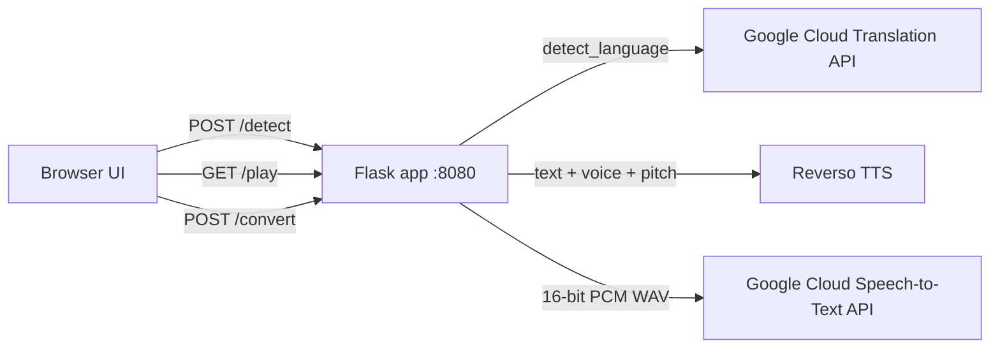
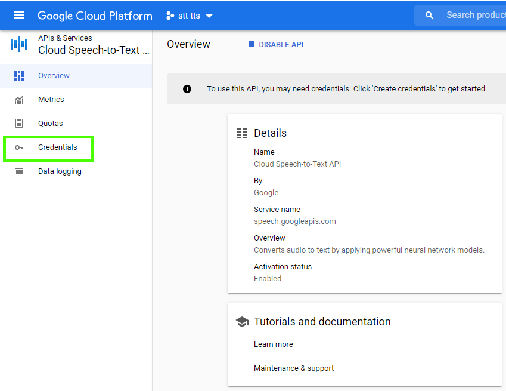
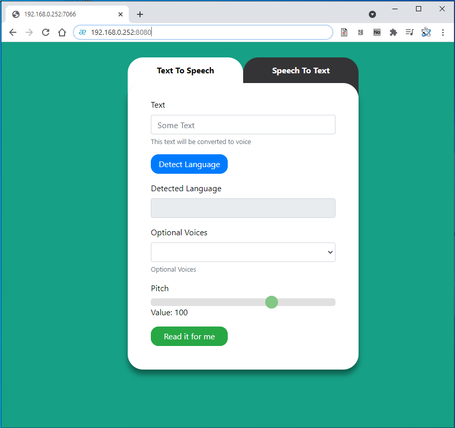

# TTS-STT
## Text To Speech & Speech To Text

[](https://hub.docker.com/r/techblog/tts-stt)
[](LICENSE)

TTS-STT is a small, easy-to-use web app powered by Python and [Flask](https://flask.palletsprojects.com/) that helps you convert text to speech or speech to text. It ships as a Docker container: open it in the browser, type some text and have it read aloud, or upload an audio file and get a transcript back.

## Table of Contents

- [Features](#features)
- [How it works](#how-it-works)
- [Requirements](#requirements)
- [Installation](#installation)
- [Configuration](#configuration)
- [Usage](#usage)
- [API reference](#api-reference)
- [Supported languages and voices](#supported-languages-and-voices)
- [Security notes](#security-notes)
- [Troubleshooting](#troubleshooting)
- [Development](#development)
- [Contributing](#contributing)
- [License](#license)

## Features

- **Text to Speech** using [Reverso](https://www.reverso.net) voices (via [pyttsreverso](https://github.com/rt400/pyttsreverso)), returned as MP3 and played in the browser.
- **Language detection** of the input text (Google Cloud Translation API), which then lists the matching voices.
- **Voice selection** from 22 languages defined in `ttstt/voices.yaml`.
- **Adjustable pitch** (slider from 1 to 150, default 100).
- **Speech to Text** using the Google Cloud Speech-to-Text API, for 75 language/locale codes defined in `ttstt/languages.yaml`.
- Transcribes **MP3, MP4 and OGG** uploads (lower-case file extensions). They are converted to 16-bit PCM WAV with ffmpeg/pydub before they are sent to Google. WAV and AAC uploads are accepted by the form but currently fail; see [Troubleshooting](#troubleshooting).
- Speech-to-Text uses Google's synchronous recognition, so audio is limited to **about 1 minute**.

## How it works



- **TTS:** the text is first sent to `/detect`, which uses the Google Cloud Translation API to detect its language. The UI then loads the voices for that language from `voices.yaml`. Clicking **Read it for me** calls `/play`, which asks Reverso for an MP3 (128 kbps) and streams it back.
- **STT:** the uploaded file is saved in the container, converted to WAV if needed, re-encoded as 16-bit PCM, and sent to Google Cloud Speech-to-Text with the file's sample rate and channel count. The first transcript alternative is returned as plain text.

### Components and frameworks used in TTS-STT
* [Flask](https://flask.palletsprojects.com/) and [Flask-RESTful](https://pypi.org/project/Flask-RESTful/)
* [Loguru](https://pypi.org/project/loguru/)
* [Google Cloud Speech](https://pypi.org/project/google-cloud-speech/)
* [Google Cloud Translate](https://pypi.org/project/google-cloud-translate/) (2.0.1)
* [Wavinfo](https://pypi.org/project/wavinfo/)
* [SoundFile](https://pypi.org/project/SoundFile/)
* [Pydub](https://pypi.org/project/pydub/)
* [PyYAML](https://pypi.org/project/PyYAML/)
* Thanks to [Yuval Mejahez](https://github.com/rt400) for creating [pyttsreverso](https://github.com/rt400/pyttsreverso). <!-- TODO: verify — the old README said to run pyttsreverso 0.3, but requirements.txt does not pin a version -->

The Text to Speech feature is free thanks to [Reverso Translations](https://www.reverso.net). Speech to Text and language detection use Google Cloud APIs and require an active Google Cloud account with billing enabled (see the [Speech-to-Text pricing](https://cloud.google.com/speech-to-text/pricing) and [Translation pricing](https://cloud.google.com/translate/pricing) pages).

## Requirements

- Docker (the image is published for `linux/amd64` only).
- A Google Cloud project with billing enabled and these APIs turned on:
  - **Cloud Speech-to-Text API** (Speech to Text)
  - **Cloud Translation API** (language detection in the TTS tab)
- A Google Cloud **service-account key** in JSON format.
- Outbound internet access from the container to Google and Reverso.

## Installation
As I mentioned, to use Google Speech Recognition we need to create a Google application and enable the API. Here are the steps you need to follow to integrate the app with the Google Speech-to-Text API.

### Step 1) Create a Google Application
The first thing you need to access Google APIs is a Google account and a Google application (project). You can create a Google application using the Google Cloud console: [Go to Google Cloud console](https://console.cloud.google.com/).

Once you open the Google Cloud console, click on the dropdown at the top. This dropdown displays your existing Google applications. After clicking, a pop-up will appear. Click on “New Project.”

[](screenshots/google%20applications%20dashboard.png "Google Application")

[](screenshots/new%20project.png "New Application")

Then enter your application name and click on Create.

### Step 2) Enable the Cloud Speech-to-Text API
Once you have created your Google application, you need to grant it access to the “Cloud Speech-to-Text” API. To do so, go to the application dashboard and from there, go to the APIs overview. See below how to access it:

[](screenshots/apis%20overview.png "APIs overview")

Click on “Enable APIs and Services,” and then search for “speech.” All Google APIs related to speech will be listed.

[](screenshots/enable%20api%20and%20services.png "Enable APIs and Services")

[](screenshots/enable%20stt%20service.png "Enable STT")

Then click “Enable.” Once enabled, your application has access to the “Cloud Speech-to-Text API.”

> **Also enable the Cloud Translation API.** The “Detect Language” button in the Text To Speech tab calls the Cloud Translation API. Repeat the steps above, search for “translation,” and enable **Cloud Translation API**.

### Step 3) Download Google Credentials
The next step is downloading your Google credentials. The credentials are necessary so Google can authenticate your application, and therefore Google knows that their API is being accessed by you. This way, they can measure how much you are using their APIs and charge you if the consumption passes the free threshold.

Here are the steps to download the Google credentials. First, from the home dashboard, go to “Go to APIs overview,” just like before, and on the left-hand side menu, click on Credentials.

[](screenshots/credentials.png "Credentials")

Then click on “Create Credentials” and create a “Service Account.”

[](screenshots/Service%20Account.png "Service Account")

Enter any service account name you like, and click Create.
Optionally, you can grant the service account access to the project, and click Done.

[](screenshots/Grant%20Access.png "Grant Access")

> The screenshot shows the **Owner** role. The app does not need it: grant the narrowest role that works, because anyone holding the key gets that role's access. <!-- TODO: verify the minimum IAM roles needed for Speech-to-Text and Translation (e.g. Cloud Translation API User) -->

Now click on the service account you just created. This will take you to the service account details.

[](screenshots/Service%20Accounts.png "Service account details")

Go to the “Keys” section and click on “Add Key” and “Create New Key,” which will create a new key. This key is associated with your application through the service account.

[](screenshots/add%20key.png "Add Key")

In the pop-up, select JSON and click on Create, which will download a JSON file containing the key to your machine. Please make a note of where you save this file since you will need it next.

[](screenshots/Key%20type.png "JSON File")

### Step 4) Installing the container
#### Docker Compose (image from Docker Hub)
```yaml
version: "3.7"
services:
  tts-stt:
    image: techblog/tts-stt:latest
    ports:
      - "8080:8080"
    container_name: tts-stt
    labels:
      - "com.ouroboros.enable=true"
    networks:
      - default
    volumes:
      - ./ttstt/keys/key-file.json:/opt/ttstt/keys/key-file.json:ro
      - /etc/localtime:/etc/localtime:ro
    restart: unless-stopped
```
The container path `/opt/ttstt/keys/key-file.json` is mandatory (it is hard-coded in the app and you can't change it). Mount the key file you created and downloaded in Step 3 at that path. The file name on the host can be anything.

Now, run `docker compose up -d` (or `docker-compose up -d`) to pull and run your container.

#### Docker CLI
```bash
docker run -d --name tts-stt \
  -p 8080:8080 \
  -v "$PWD/key-file.json:/opt/ttstt/keys/key-file.json:ro" \
  --restart unless-stopped \
  techblog/tts-stt:latest
```

#### Build the image yourself
```bash
git clone https://github.com/t0mer/tts-stt.git
cd tts-stt
docker build -t tts-stt .
```
Then run it with either of the commands above, replacing `techblog/tts-stt:latest` with `tts-stt`.

#### Published images

| Registry | Image | Tags | Platforms |
|----------|-------|------|-----------|
| Docker Hub | [`techblog/tts-stt`](https://hub.docker.com/r/techblog/tts-stt) | `latest` (= `1.8.0`), `1.8.0`, `1.4.0`, `1.3.0`, `1.2.0`, `1.1.0`, `1.0.0`, `dev` | `linux/amd64` |

Open your browser and navigate to your container's IP address on port 8080. You should see the following screen:

[](screenshots/tts-stt.PNG "TTS")

## Configuration

The app has no environment variables, flags or config file of its own. Everything is fixed in the code:

| Setting | Value | Where |
|---------|-------|-------|
| Listen address / port | `0.0.0.0:8080` | `ttstt/ttstt.py` (`app.run`) |
| Google credentials | `/opt/ttstt/keys/key-file.json` | `GOOGLE_APPLICATION_CREDENTIALS` is set inside `ttstt.py` and overrides any value you pass in |
| Upload / temp folder | `/opt/ttstt/` | `UPLOAD_FOLDER` in `ttstt.py` |
| TTS voices | `/opt/ttstt/voices.yaml` | see [Supported languages and voices](#supported-languages-and-voices) |
| STT languages | `/opt/ttstt/languages.yaml` | see [Supported languages and voices](#supported-languages-and-voices) |
| Upload types accepted by validation | `wav`, `mp3`, `mp4`, `aac`, `ogg` (only lower-case `mp3`, `mp4`, `ogg` transcribe successfully) | `allowed_file()` |
| Flask debug mode | on (`debug=True`), which enables the Werkzeug interactive debugger and the auto-reloader | `app.run` in `ttstt.py` |
| TTS bitrate | `128k` MP3 | `/play` |
| Upload size limit | none set in the app | Google's synchronous recognition limits audio to about 1 minute |

To change the port on the host, change the left side of the port mapping (for example `"9090:8080"`). You can mount your own `voices.yaml` / `languages.yaml` over the files in `/opt/ttstt/` to change the lists.

## Usage

### Text To Speech
1. Type the text in **Text**.
2. Click **Detect Language**. The detected language appears in **Detected Language**, and **Optional Voices** is filled with the voices for that language.
3. Pick a voice and adjust **Pitch** (1–150, default 100).
4. Click **Read it for me**. The browser plays the MP3.

### Speech To Text
1. Open the **Speech To Text** tab.
2. **Browse…** for an MP3, MP4 or OGG file with a lower-case extension (up to about 1 minute of audio).
3. Pick the spoken language from the list.
4. Click **Write it for me**. The transcript appears in the text box.

## API reference

The web UI calls these endpoints; you can call them directly too. There is no authentication.

| Method | Path | Purpose |
|--------|------|---------|
| `GET` | `/` | Web UI |
| `GET` | `/languages` | List of Speech-to-Text languages (JSON) |
| `POST` | `/voices` | Voices for a language (JSON) |
| `POST` | `/detect` | Detect the language of a text (JSON) |
| `GET` | `/play` | Text to Speech, returns MP3 audio |
| `POST` | `/convert` | Speech to Text, returns the transcript as text |
| `GET` | `/js/<path>`, `/css/<path>` | Static files |
| `GET` | `/stt` | Leftover route: it renders `stt.html`, which does not exist, so it returns a 500 error |

### `GET /languages`
Returns the contents of `languages.yaml` as a JSON object:
```json
{"language_1": {"name": "Afrikaans (South Africa)", "code": "af-ZA"}, "...": {}}
```

### `POST /voices`
The request body is the language key from `voices.yaml` (it is read as the first form field name):
```bash
curl -X POST --data 'en' http://localhost:8080/voices
```
```json
{"id": 1, "name": "English", "voices": {"voice_1": "Heather-US-English", "...": "..."}}
```

### `POST /detect`
The request body is the text itself (read as the first form field name, so avoid `=` and `&` in the text):
```bash
curl -X POST --data 'Hello world' http://localhost:8080/detect
```
The response is a JSON **string** that contains a JSON object, so parse it twice:
```json
"{\"success\":1,\"lang\":\"en\",\"name\":\"English\"}"
```
On failure: `"{\"success\":0,\"error\":\"...\"}"`.

### `GET /play`
| Query parameter | Description |
|-----------------|-------------|
| `text` | Text to speak |
| `voice` | A Reverso voice name from `voices.yaml`, for example `Heather-US-English` |
| `pitch` | 1–150 (the UI default is 100) |

```bash
curl -o hello.mp3 "http://localhost:8080/play?text=Hello%20world&voice=Heather-US-English&pitch=100"
```

### `POST /convert`
`multipart/form-data` with two fields:

| Field | Description |
|-------|-------------|
| `file` | Audio file: `mp3`, `mp4` or `ogg` (lower-case extension). `wav` and `aac` pass validation but fail; see [Troubleshooting](#troubleshooting) |
| `languages` | Language code from `languages.yaml`, for example `en-US` |

```bash
curl -F "file=@recording.mp3" -F "languages=en-US" http://localhost:8080/convert
```
On success, the response body is the transcript, served as `text/html; charset=utf-8`. Error responses:

- The explicit validation checks (no file, unsupported file type, empty file name) return a JSON string, for example `"{\"error\":\"File type not supported\",\"success\":\"false\"}"`.
- A missing `languages` field returns Flask's standard `400 Bad Request` HTML page.
- Conversion or recognition errors, including audio in which nothing is recognized, return a `500 Internal Server Error`.

## Supported languages and voices

### `voices.yaml` (Text to Speech)
Keyed by the language code that the Google Cloud Translation API returns (for example `en`, `iw` for Hebrew):
```yaml
en:
   id: 1
   voices:
      voice_1: Heather-US-English
      voice_2: Karen-US-English
   name: English
```
Languages included: English, Arabic, Portuguese, Catalan, Czech, Danish, Dutch, Finnish, French, German, Greek, Hebrew, Italian, Japanese, Korean, Norwegian, Polish, Romanian, Russian, Spanish, Swedish and Turkish.

### `languages.yaml` (Speech to Text)
75 entries, each with a display name and the locale code sent to Google Speech-to-Text:
```yaml
language_1:
  name: Afrikaans (South Africa)
  code: af-ZA
```

## Security notes

- **There is no authentication**, and the app runs on Flask's built-in development server. Run it only on a trusted network, and don't expose it to the internet.
- **Debug mode is on.** The app runs with Flask `debug=True`, which enables the Werkzeug interactive debugger. Never expose the port to untrusted networks.
- **Uploaded file names are used as-is.** The app saves uploads under the name the client sends, without sanitizing it. This is another reason to keep the service away from untrusted users.
- **The service-account key file is a secret.** Mount it read-only (`:ro`), keep it out of Git and out of the image, and give the service account only the roles it needs.
- **Your data goes to third parties.** Text you convert is sent to Google (language detection) and Reverso (speech). Uploaded audio is sent to Google. Google Cloud usage is billed to your project, so watch your costs.

## Troubleshooting

- **The container exits at startup:** the Google client is created when the app starts, so the key file must exist at `/opt/ttstt/keys/key-file.json`. Check the volume mount path.
- **“Detect Language” doesn't work:** make sure the Cloud Translation API is enabled for the project that owns the service account, and that billing is active.
- **Speech to Text fails on long files:** synchronous recognition accepts about 1 minute of audio. Trim the recording.
- **Wrong transcript, or a 500 error with no transcript:** when Google recognizes nothing, the request fails with a 500 error instead of returning an empty transcript. Check that the language you picked matches the spoken language and that the audio contains clear speech.
- **Known upload issues:**
  - **WAV** uploads fail: the file is deleted during processing before it is sent to Google. Convert it to MP3 or OGG first.
  - **AAC** uploads fail with a server error. Convert them to MP3 or OGG first.
  - **Upper-case extensions** (for example `.MP3`) pass validation but are not converted, so the request fails. Rename the file to a lower-case extension.

## Development

Project layout:
```
ttstt/
  ttstt.py          # Flask app (all routes)
  templates/        # index.html (web UI)
  js/ css/ fonts/ img/
  voices.yaml       # TTS voices per language
  languages.yaml    # STT languages
Dockerfile          # ubuntu:20.04 + python3, ffmpeg, portaudio
requirements.txt
VERSION             # version used for tags, releases and image tags
```

The app reads its files from `/opt/ttstt/`, so the simplest way to run it is the Docker image. Build it with `docker build -t tts-stt .`.

### CI/CD workflows

| Workflow | Trigger | What it does |
|----------|---------|--------------|
| `sonarscan.yml` (SonarCloud Scan) | push to `main`, manual | Runs a SonarCloud scan (`sonar-project.properties`) |
| `release.yml` (Create Release) | after SonarCloud Scan completes, manual | Creates a Git tag and a GitHub release named “Development Build - &lt;VERSION&gt;” from the `VERSION` file |
| `docker-image.yml` (Docker Build) | after Create Release completes, manual | Builds `linux/amd64` and pushes `techblog/tts-stt:latest` and `techblog/tts-stt:<VERSION>` to Docker Hub |
| `publish-ghcr.yml` (Publish to GHCR) | manual, optional `tag` input | Builds `linux/amd64`, `linux/arm64`, `linux/arm/v7` and pushes `ghcr.io/t0mer/tts-stt:<tag>` and `:latest` (no GHCR image is published at the time of writing) |

## Contributing

Issues and pull requests are welcome. Please keep changes focused, and describe how you tested them.

## License

This project is licensed under the Apache License 2.0. See [LICENSE](LICENSE).
